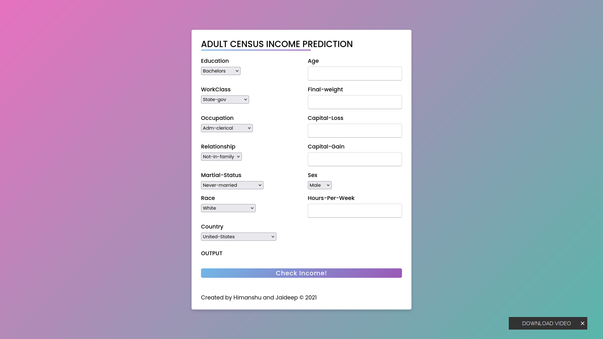
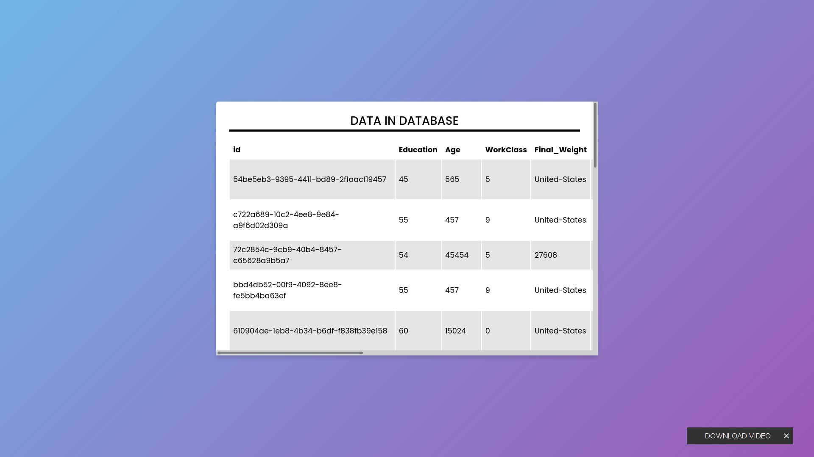

# Adult Census Income Prediction

## Problem Statement:

The Goal is to predict whether a person has an income of more than 50K a year or not.
This is basically a binary classification problem where a person is classified into the
>50K group or <=50K group.

## Approach

The classical machine learning tasks like Data Exploration, Data Cleaning,
Feature Engineering, Model Building and Model Testing. Try out different machine
learning algorithms that’s best fit for the above case.

<pre> 
<li> Data Exploration     :  I started exploring dataset using pandas,numpy,matplotlib and seaborn. </li>
<li> Data visualization   :  Plotted graphs to get insights about dependent and independent variables. </li>
<li> Feature Engineering  :  Removed missing values and created new features as per insights.</li>
<li> Model Selection I    :  Tested all base models to check the base accuracy.</li>
<li> Model Selection II   :  Performed Hyperparameter tuning using gridsearchCV</li>
<li> Pickle File          :  Selected model as per best accuracy and created pickle file using joblib .</li>
<li> Webpage & deployment :  Created a webpage that takes all the necessary inputs from user and shows output.
                                After that I have deployed project on heroku AWS</li></pre>

## Deployment Links

 Link Heroku : https://adultincomeprediction.herokuapp.com/  
AWS Link : http://adultincomepredicyionproject-env.eba-2kmfag3h.us-east-2.elasticbeanstalk.com/ 

## UserInterface

## Technologies Used
<pre> 
1. Python 
2. Sklearn
3. Flask
4. Html
5. Css
6. Pandas, Numpy 
7. Database 
8. Hosting
9. Docker

</pre>

## High Level Design Document 

## Low Level Design Document 

## Help Me Improve

 Hello Reader if you find any bug please consider raising issue I will address them asap.

